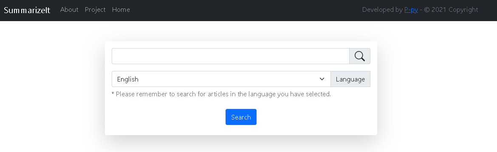
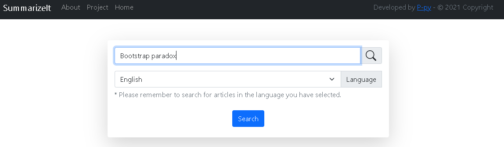
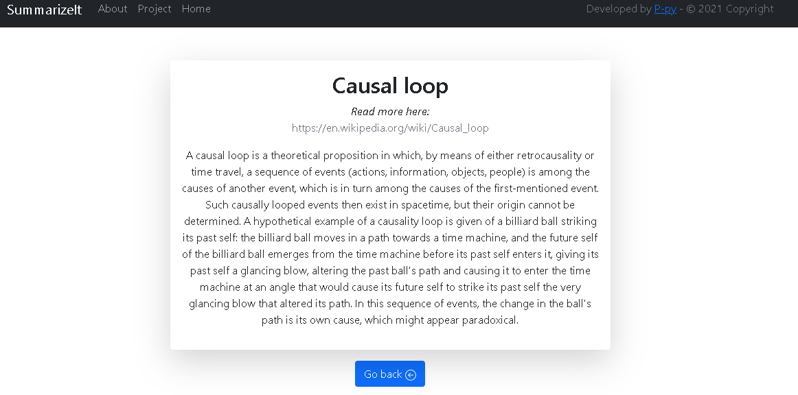

# SummarizeIt
> SummarizeIt é uma plataforma de pesquisa baseada na web, sendo implementada em python e podendo pesquisar e resumir qualquer tópico que esteja disponível na WikipediaAPI

SummarizeIt é uma plataforma de busca por indexação feita com base nos módulos e APIs [WikipediaAPI-python](https://wikipedia.readthedocs.io/en/latest/) e [Wikipedia-Search-Tool](https://github.com/P-py/Wikipedia-Search-Tool). Tendo a sua versão web baseada em um Backend [python](https://www.python.org/) com [Flask](https://flask.palletsprojects.com/en/2.0.x/) e um Frontend baseado em JavaScript e [Bootstrap-CSS](https://getbootstrap.com/). Através da plataforma SummarizeIt é possível realizar uma busca de qualquer artigo que esteja disponível dentro da base de dados da [Wikipedia](https://www.wikipedia.org/) e receber, através disso, um resumo/síntese do mesmo.



## Deploy oficial

[SummarizeIt on Heroku](http://thesummarizeit.herokuapp.com/)

## Tecnologias utilizadas
- Python - version 3.9.6
- Flask - version 2.0.2
- WikiMedia
- WikipediaAP
- Bootstrap CSS - version 5.1.3
- HTML

## Features
- Resumir e apresentar ao usuário através de "busca por termos" um resultado baseado na base de dados da Wikipedia

## Melhorias
Áreas para melhorar:
- Melhorias na U.I e U.X

To do:
- ~~Update na *About page*~~
- Um pouco de preenchimento visual
- Otimização para mobile no dropdown dos idiomas
- ~~Nova *flash message* para o caso de busca vazia~~
- Adaptação da página para outras línguas

## Instalação

Antes de tudo, você vai precisar do `python` e do `git`, eu não irei ensinar os processos de instalação de nenhum desses por aqui, nem mesmo a configuração, caso precise de algum ou ainda não tem eles instalados ou ainda não sabe como verificar se tem, basta ir para:

- [Python.org](https://www.python.org/downloads/)
- [Git page](https://git-scm.com/)
- [Como instalar o git no Windows](https://phoenixnap.com/kb/how-to-install-git-windows)
- [Como instalar o git no Mac](https://phoenixnap.com/kb/install-git-on-mac)
- [Como instalar o git no Linux](https://www.tutorialspoint.com/how-to-install-git-on-linux)


*O tutorial a seguir serve apenas para rodar a aplicação em uma rede e endereço locais*

OS X & Linux:

```sh
#Clonando o repositório para pegar os arquivos
git clone https://github.com/P-py/SummarizeIt-open
cd SummarizeIt-open

#Verificando a instalação do python (caso falhar recomendo voltar no texto acima.)
python3 --version

#Instalando os requisitos do pip para rodar o código da aplicação
pip3 install -r requirements.txt

#Inicializando o servidor
flask run
```

Windows:

```sh
#Clonando o repositório para pegar os arquivos
git clone https://github.com/P-py/SummarizeIt-open
cd SummarizeIt-open

#Verificando a instalação do python (caso falhar recomendo voltar no texto acima.)
python --version

#Instalando os requisitos do pip para rodar o código da aplicação
pip install -r requirements.txt

#Inicializando o servidor
flask run
```

## Exemplo de uso

Com o Summarizeit é possível buscar um termo, e caso este ou algo relacionado a ele estiver disponível dentro da base de dados da Wikipedia, o mesmo será exibido em uma página de resultado que mostrará um resumo sobre ele. 

No exemplo abaixo pode-se observar a relação do "Paradoxo de Bootstrap" ou "Bootstrap paradox" com o artigo da wikipedia sobre "Causal Loop".




## Histórico de lançamentos

* 0.0.1
    * Trabalho em andamento
    * Desenvolvimento do wireframe básico
    * Primeira release

* 0.0.5
    * Adição de mais conteúdo na "about page"
    * Deploy oficial no Heroku
    * Flash message para busca vazia
    * Botão de dúvida na index

## Meta

Pedro Santos – [@P-py](https://github.com/P-py) - entre em contato por [twitter](https://twitter.com/curliy1).

Distribuído sob a licença MIT. Veja `LICENSE` para mais informações.

[https://github.com/P-py/SummarizeIt-open](https://github.com/P-py/SummarizeIt-open)

## Contributing

1. Faça o _fork_ do projeto (<https://github.com/yourname/yourproject/fork>)
2. Crie uma _branch_ para sua modificação (`git checkout -b feature/fooBar`)
3. Faça o _commit_ (`git commit -am 'Add some fooBar'`)
4. _Push_ (`git push origin feature/fooBar`)
5. Crie um novo _Pull Request_
